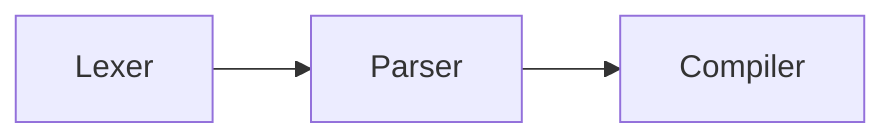

# chris

Pratt parser implementation in Go for parsing mathematical equations

---

The core implementation details follows the advice by
Bob Nystrom detailed in
his [article on Pratt parsing](http://journal.stuffwithstuff.com/2011/03/19/pratt-parsers-expression-parsing-made-easy/)

My notes on Pratt parsing and this project can be
found [here.](https://woojiahao.notion.site/Pratt-Parsing-Notes-a3ccdbc32a424be6bcf67f52769ebd94)

`chris` hopes to allow for user input mathematical equations that can be parsed and compiled into valid Go functions
that can be used with plotting libraries in Go like `gonum/plot`. However, there are many other ways to use such a
library.

## Sample

`chris` supports most mathematical equations that Desmos supports. Additional operators will be added down the line. To
view the current operators, refer [here.](#operatorssymbols)

```text
1 + 2 * 3               := 1 + (2 * 3)
sin(pi/4)               := sin((pi/4))
2^x + cos(pi/4 + 15)    := (2^x) + cos(((pi/4) + 15))
```

## Usage

To use `chris` in your own project, download it as a package in Go modules:

```command
go get github.com/woojiahao/chris
```

To set up a basic compiler, we will use both the `lexer` and `parser` modules. The `lexer` generates the token stream
and the `parser` will be able to parse that token stream into a given Abstract Syntax Tree (AST). For more information
about the roles of either component, refer below.

`lexer` receives a keyword and constant list to determine how these tokens are tokenized.

`parser` only requires the `lexer` to generate the AST. To retrieve the AST, we simply call `parser#Parse`.

```go
package compiler

import (
	"fmt"
	"github.com/woojiahao/chris/pkg/lexer"
	"github.com/woojiahao/chris/pkg/parser"
)

type Compiler struct {
	l *lexer.Lexer
	p *parser.Parser
}

func New(exp string) *Compiler {
	keywords := []string{"sin", "cos", "tan", "csc", "sec", "cot"}
	constants := []string{"pi"}
	l := lexer.New(exp, keywords, constants)
	p := parser.New(l)

	// Parse expression and get AST. We ignore the err for now
	ast, _ := p.Parse()
	fmt.Printf("AST: %v\n", ast)

	return &Compiler{l, p}
}
```

Refer to `example/` for a sample compiler which parses the equation and generates a function of
type `func(float64) float64` that can be used in plotting libraries like `gonum/plot`.

## Architecture

The general architecture of a programming language compiler can be found here:



1. `Lexer` - acts as an iterator over a given expression and converts each character/word into a given token. It ignores
   whitespaces and will parse numbers and words as a whole chunk.

2. `Parser` - reads the token stream from a given Lexer and applies grammar to the tokens to generate an AST tree. It is
   not responsible for checking if the keywords are valid. It just needs to know that the expression can generate a
   valid AST tree.

3. `Compiler` - receives the generated AST tree from the Parser and performs operations on the given AST tree and the
   respective nodes. `chris`, however is not a compiler, but a parser, so it will not compile the given AST.

### Parselets

Parser logic is performed by something known as "Parselets". Effectively, they are the components that handles behavior
of each token. This is slightly different to having functions per non-terminal character in our grammar.

We have two kinds of parselets, prefix and infix. Prefix parselets are what can start an independent sub-expression like
numbers, `(` or variables, while infix parselets require a left and right sub-expression to generate a node.

## Operators/Symbols

| Symbol      | Purpose                                                     | Position     | Precedence |
|-------------|-------------------------------------------------------------|--------------|------------|
| +           | Addition                                                    | Infix        | 2          |
| -           | Subtraction                                                 | Prefix/Infix | 2          |
| *           | Multiplication                                              | Infix        | 3          |
| /           | Division                                                    | Infix        | 3          |
| ^           | Exponent                                                    | Infix        | 4          |
| (           | Create sub-expression or encapsulate a function's arguments | Prefix/Infix | 5          |
| )           | End sub-expression                                          | -            | -1         |
| =           | Assignment                                                  | Infix        | 1          |
| \<keyword>  | Keyword that corresponds to a function                      | Infix        | 1          |
| \<number>   | Number                                                      | Prefix       | 1          |
| \<variable> | Single character to represent a variable                    | Prefix       | 1          |
| \<constant> | User-specified constant                                     | Prefix       | 1          |

## BNF

```elixir
# chris BNF
# General terminals
<digit>         ::= '0' | ... | '9'
<letter>        ::= 'a' | ... | 'z'
                | 'A' | ... | 'Z'

# Terminals in chris
<number>        ::= <digit> 
                | <digit>'.'<digit>
                | <number><digit>
<variable>      ::= <letter>
<keyword>       ::= <letter>+

# Non-terminals
<operator>      ::= '+' | '-' | '*' | '/' | '^'
<unary>         ::= '-'
<expression>    ::= <number>
                | <variable>
                | <keyword> 
                | <unary> <expression> 
                | <expression> <operator> <expression> 
                | <expression> <expression> 
                | <function call> 
                | <group>
<function call> ::= <keyword> '(' <expression>* ')'
<group>         ::= '(' <expression> ')'
<assignment>    ::= <variable> '=' <expression>
```